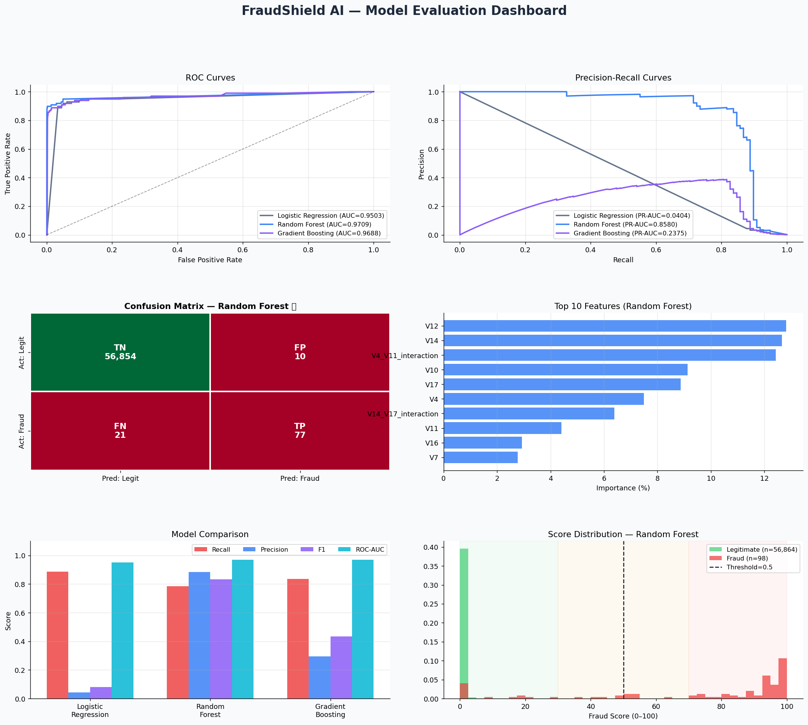
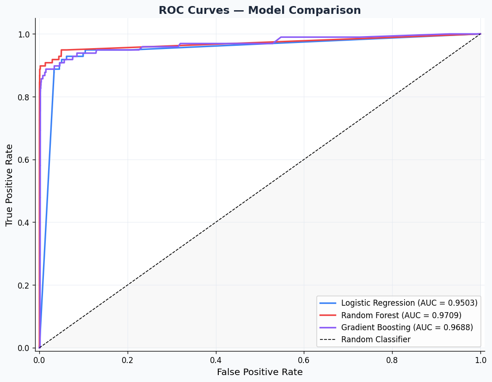
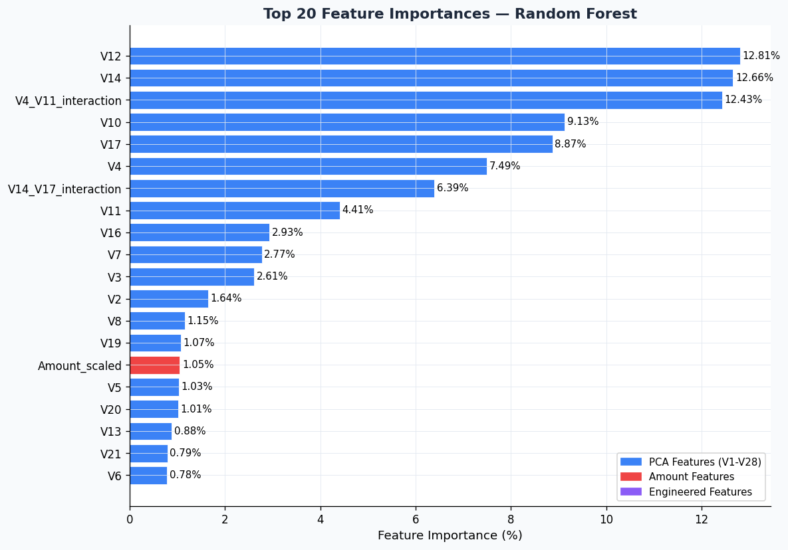
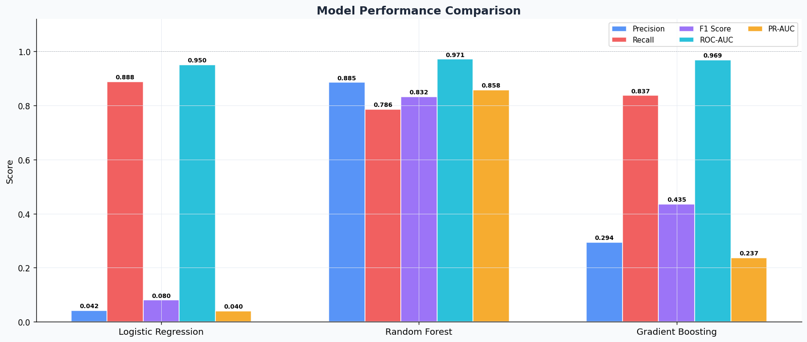

# 🛡️ FraudShield AI — Enterprise Fraud Detection Platform

🚀 Designed as a **production-ready fintech fraud detection system**, not just a machine learning model.

> An end-to-end AI-powered fraud detection platform with real-time prediction, explainable AI, and an interactive dashboard.

---

## 📋 Table of Contents

* [Business Use Case](#business-use-case)
* [Architecture](#architecture)
* [Tech Stack](#tech-stack)
* [Project Structure](#project-structure)
* [Quick Start](#quick-start)
* [System Components](#system-components)
* [Model Performance](#model-performance)
* [API Reference](#api-reference)
* [Dashboard Guide](#dashboard-guide)
* [Screenshots](#screenshots)

---

## 💼 Business Use Case

Credit card fraud costs the global financial industry **$32+ billion annually**. Traditional systems struggle with detecting modern fraud patterns and often generate false positives.

**FraudShield AI solves this with:**

| Challenge                       | Solution                                 |
| ------------------------------- | ---------------------------------------- |
| Extreme class imbalance (577:1) | SMOTE, undersampling, class weights      |
| Low interpretability            | Explainable AI (local + global insights) |
| Batch-only detection            | Real-time fraud prediction system        |
| Black-box decisions             | “Why is this fraud?” explanations        |
| Static thresholds               | Dynamic threshold tuning                 |

---

## 🏗️ Architecture

```
Data Ingestion → Feature Engineering → Model Training → Explainability
        ↓
Real-Time Engine → API Layer → Dashboard UI
```

---

## 🛠️ Tech Stack

| Layer          | Tools               |
| -------------- | ------------------- |
| Data           | Pandas, NumPy       |
| ML             | Scikit-learn        |
| Visualization  | Matplotlib, Seaborn |
| Explainability | Custom XAI          |
| Backend        | FastAPI             |
| Frontend       | Streamlit           |
| Storage        | joblib              |

---

## 📁 Project Structure

```
fraudshield-ai/
│── app/
│── src/
│── models/
│── logs/
│── images/
│── README.md
│── requirements.txt
│── train_pipeline.py
```

---

## 🚀 Quick Start

```bash
pip install -r requirements.txt

python train_pipeline.py

streamlit run app/dashboard.py

uvicorn app.api:app --port 8000
```

---

## 🔬 System Components

### 🔹 Data Ingestion

* Chunk-based loading for large datasets
* Memory optimization
* Schema validation

### 🔹 Feature Engineering

* Normalization (Amount, Time)
* Velocity features
* Rolling averages
* Anomaly indicators

### 🔹 Modeling

* Logistic Regression
* Random Forest ⭐ (Best)
* Gradient Boosting

### 🔹 Explainable AI

* Feature importance
* Transaction-level reasoning
* Fraud scoring (0–100)

### 🔹 Real-Time Engine

* Live transaction simulation
* Risk categorization
* Alert system

---

## 📊 Model Performance

| Model               | Precision | Recall   | F1     |
| ------------------- | --------- | -------- | ------ |
| Logistic Regression | Low       | High     | Low    |
| Random Forest ⭐     | High      | Balanced | Best   |
| Gradient Boosting   | Medium    | High     | Medium |

---

## 🌐 API Reference

| Endpoint     | Method | Purpose            |
| ------------ | ------ | ------------------ |
| `/predict`   | POST   | Predict fraud      |
| `/explain`   | POST   | Explain prediction |
| `/metrics`   | GET    | Model metrics      |
| `/threshold` | POST   | Adjust threshold   |

---

## 🖥️ Dashboard Guide

* 📊 Fraud distribution
* 📈 ROC & PR curves
* 🔍 Feature importance
* ⚡ Real-time simulation
* 🚨 Fraud alerts

---

## 📸 Screenshots

### 📊 Dashboard



### 📈 ROC Curve



### 🔍 Feature Importance



### 📊 Model Comparison



---

## 💡 Key Highlights

* Production-like system design
* Real-time fraud detection
* Explainable AI integration
* Interactive dashboard
* End-to-end ML pipeline

---

## 👨‍💻 Author

Tejas Pathak
B.Tech CSE | AWS Certified
Aspiring Technical Project Manager

---

## ⭐ If you like this project

Give it a ⭐ on GitHub!
